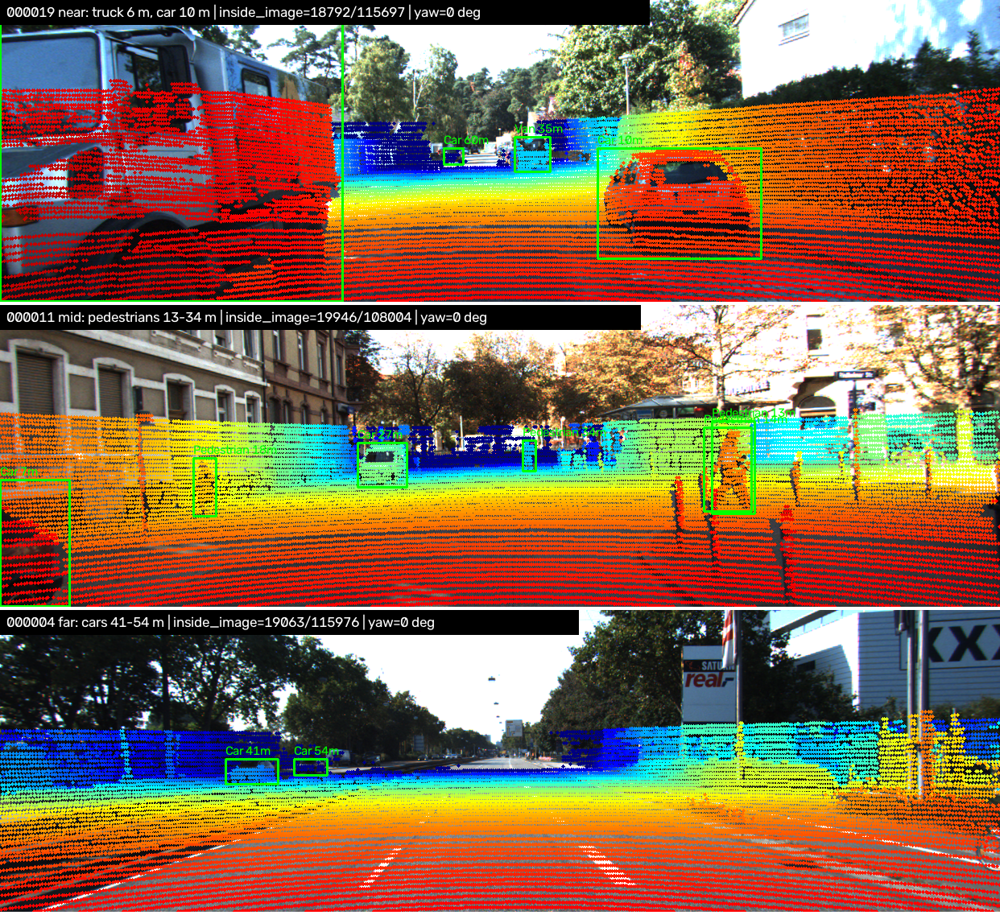
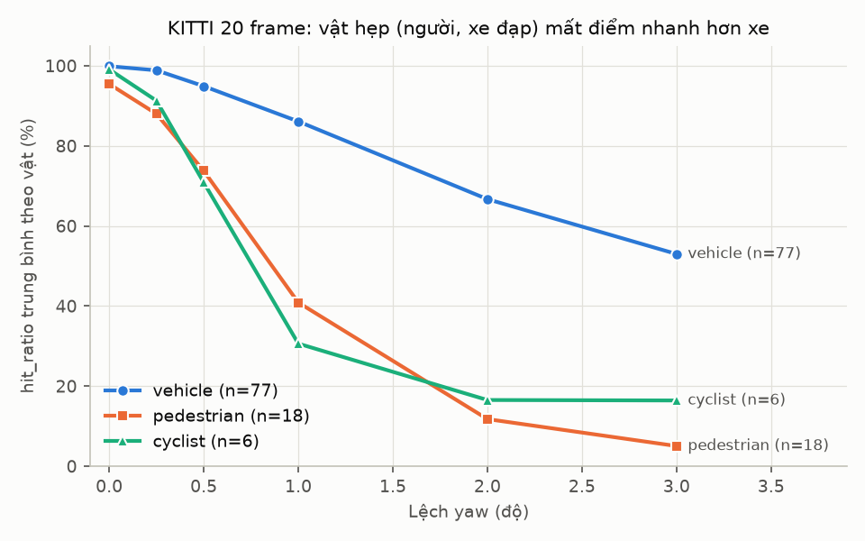
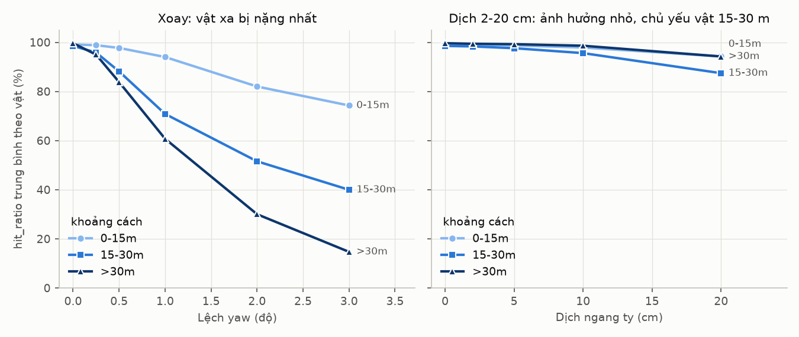
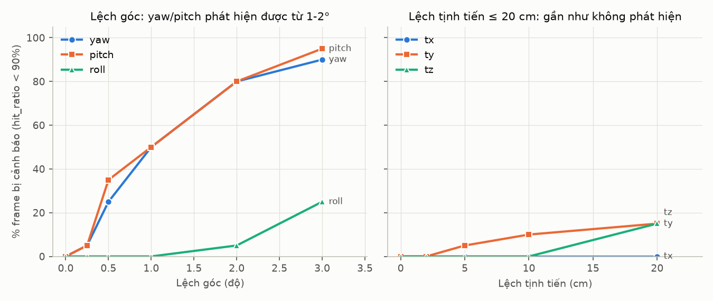
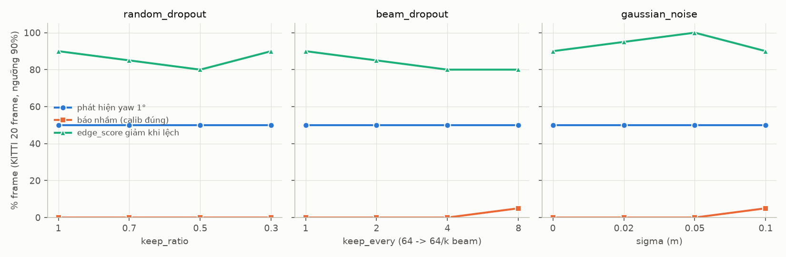
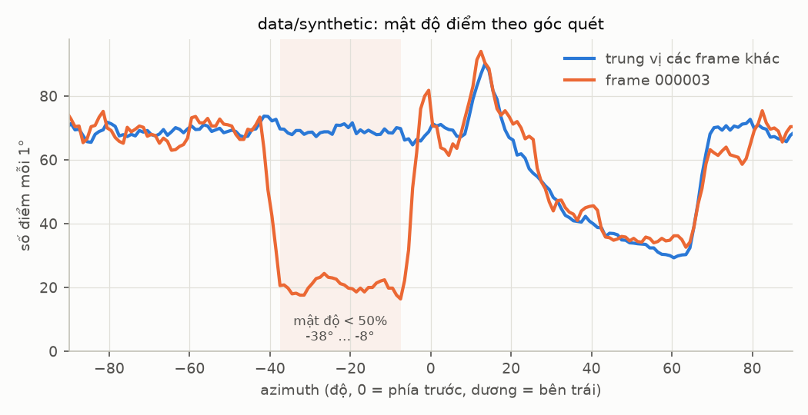
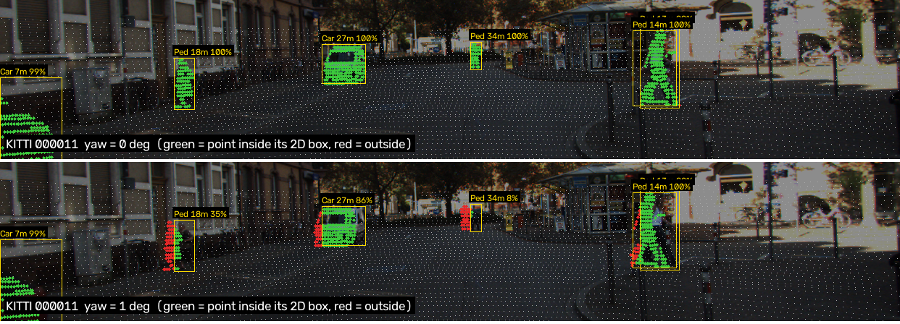
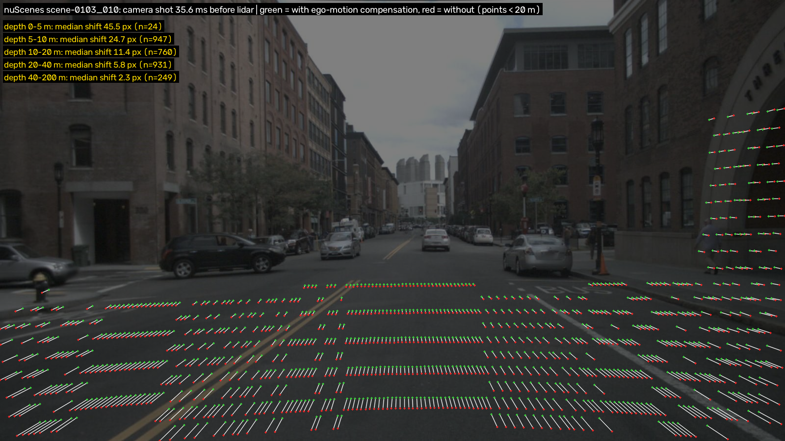
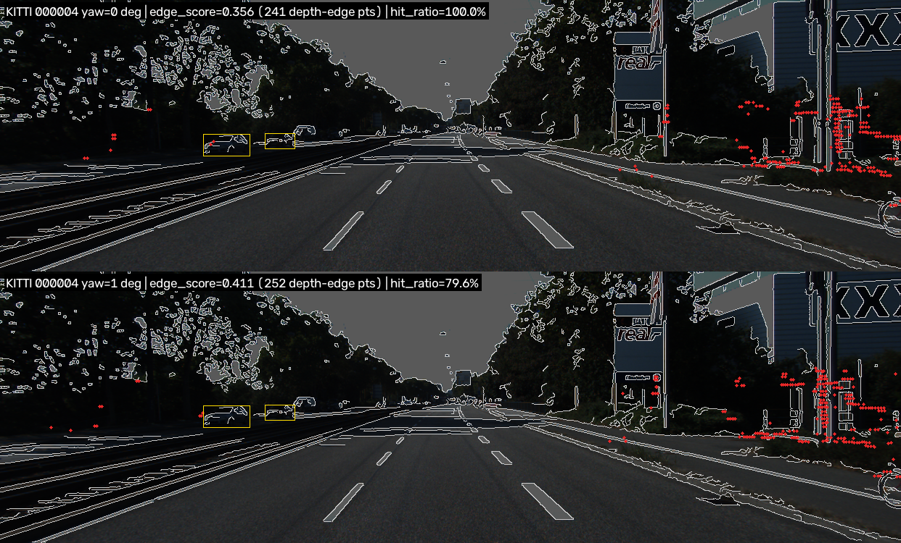

# Báo cáo Day 6: Độ nhạy của projection LiDAR-camera với lệch calibration

- **Họ tên:** Nguyễn Đăng Thực
- **MSSV:** 2A202603014
- **Lớp:** AI20K-T4
- **Link repo:** https://github.com/ThucNguyen1705/NguyenDangThuc-2A202603014-Track4-Day21
- **Topic:** A — LiDAR-camera projection QA
- **Dataset:** data/kitti_mini (chính), data/nuscenes_mini_subset (so sánh), data/synthetic (debug)
- **Các frame đã dùng:** KITTI: cả 20 frame của kitti_mini (000001 … 000061); bảng mẫu dùng 000008 (đông xe), 000011 (nhiều người đi bộ), 000049 (nhiều vật bị che); demo gần / giữa / xa dùng 000019 / 000011 / 000004. nuScenes: 20 keyframe scene-0103_000 … _036 và scene-1094_000 … _036 (bước 4), scene-0103_008 / _010 cho lỗi Time

> Hãy viết ngắn: mỗi mục từ 3 đến 8 dòng, ưu tiên số liệu và hình ảnh.

## 1. Claim

Một câu khẳng định kỹ thuật có thể kiểm chứng. Ví dụ: *"Lệch yaw 1° làm 12% điểm LiDAR rơi ra khỏi vật thể ở 30 m, phát hiện được bằng edge-alignment score với ngưỡng X."*

**Claim (sau khi có số liệu):** Trên 20 frame KITTI, lệch yaw 1° làm điểm LiDAR trượt khoảng 13 px ở **mọi** khoảng cách (lý thuyết f·tan 1° = 12.6 px), nên hit_ratio (tỉ lệ điểm của vật rơi đúng vào 2D box) của **người đi bộ giảm từ 95.4% xuống 40.9% (−54.5 điểm %)**, còn của **xe chỉ giảm từ 99.9% xuống 86.1% (−13.8 điểm %)**. Ngưỡng cảnh báo **hit_ratio < 90%** (0/20 frame sạch bị báo nhầm) phát hiện lệch yaw 1° ở **10/20 frame** và 2° ở **16/20 frame**, nhưng **không phát hiện được lệch tịnh tiến ≤ 10 cm** (tối đa 2/20 frame).

*Claim nháp ở CP1 ("xe chỉ giảm dưới 5 điểm %") bị **bác bỏ**: xe ở xa hơn 30 m chỉ rộng khoảng 38 px nên vẫn giảm 26 điểm %. Yếu tố quyết định là tỉ số **độ dịch pixel / bề rộng 2D box**, không phải class.*

## 2. Evidence

Bảng hoặc plot số liệu, kèm ảnh/video demo. Ghi rõ đường dẫn file trong `results/`.

**Demo chạy thật.** Overlay điểm LiDAR (màu theo độ sâu) + 2D box của label ở 3 khoảng cách: 000019 (truck 6 m), 000011 (người đi bộ 13–34 m), 000004 (xe 41–54 m). Ảnh từng frame riêng: `results/figures/overlay_*.png`.



**Thiết kế thí nghiệm.** Mỗi lần chỉ làm lệch **một** trục của extrinsic (`perturb_extrinsic`): yaw / pitch / roll 0–3°, hoặc tx / ty / tz 0–20 cm. Giữ nguyên frame, class (Car, Van, Pedestrian, Cyclist) và metric. **hit_ratio** = % điểm nằm trong 3D box (theo calib gốc) rơi vào 2D box của label khi chiếu bằng calib bị lệch. Không có phép ngẫu nhiên. Chạy lại 2 lần, so `filecmp` ra **GIỐNG HỆT**. Dữ liệu: 20 frame KITTI, 101 vật có ≥ 10 điểm LiDAR. CSV: `results/yaw_perturb_sweep.csv` (script mẫu), `results/calib_sweep.csv` (660 dòng, theo frame), `results/calib_sweep_objects.csv` (theo vật), `results/summary_by_group.csv`, `results/detection_rates.csv`.

| Lệch yaw | Xe (n=77, box ~83 px) | Người đi bộ (n=18, ~28 px) | Cyclist (n=6, ~17 px) | Độ dịch trung vị | % frame bị cảnh báo (hit < 90%) |
|---|---|---|---|---|---|
| 0° | 99.9% | 95.4% | 99.1% | 0 px | 0/20 |
| 0.5° | 94.9% | 73.8% | 70.9% | 6.7 px | 5/20 |
| 1° | 86.1% | 40.9% | 30.6% | 13.3 px | 10/20 |
| 2° | 66.7% | 11.8% | 16.5% | 26.7 px | 16/20 |
| 3° | 53.0% | 5.0% | 16.4% | 40.0 px | 18/20 |



- **Kiểm tra script mẫu:** bảng 3 frame khớp đúng số trong hướng dẫn (000011: 99.45% → 77.44% ở 1° → 21.23% ở 3°; 000008: 99.63% → 90.98% ở 3°), xem `results/figures/yaw_sweep.png`.
- **Vì sao vật hẹp và vật xa bị nặng nhất:** độ dịch do xoay gần như không đổi theo khoảng cách (1°: 15.0 / 13.2 / 12.9 px ở 0–15 / 15–30 / >30 m), còn bề rộng box giảm theo khoảng cách (186 → 64 → 38 px). Mô hình đơn giản **hit ≈ 1 − độ dịch / bề rộng box** khớp với 2 725 cặp (vật, cấu hình), tương quan r = 0.86 (`hit_vs_shift_ratio.png`).
- **Xoay nguy hiểm hơn tịnh tiến:** dịch ngang ty 10 cm chỉ làm điểm trượt 8.4 / 3.5 / 1.8 px ở 0–15 / 15–30 / >30 m (≈ f·d/z). hit_ratio của frame chỉ giảm từ 99.3% xuống 97.6%, và 2/20 frame bị cảnh báo. tx (dọc trục xe) gần như không đổi gì: 20 cm vẫn còn 99.0%. Roll ít ảnh hưởng nhất trong 3 góc: 1° chỉ dịch 2.8 px, vì xoay quanh trục nhìn của camera.




**[B1] So sánh 2 metric phát hiện lệch** trên cùng 20 frame KITTI, cùng các mức yaw (`src/calib_qa.py`, `results/detection_rates.csv`, `results/figures/metric_compare.png`). *edge_score* không cần label: lấy các điểm LiDAR nằm ở biên độ sâu (điểm cạnh nó trong cửa sổ 1° xa hơn ≥ 30%), đo xem chúng có rơi gần cạnh Canny của ảnh không (exp(−d/3 px)).

| Lệch yaw | hit_ratio: AUC | edge_score: AUC | hit_ratio: % frame giảm so với chính nó | edge_score: % frame giảm so với chính nó |
|---|---|---|---|---|
| 0.25° | 0.77 | 0.55 | 85% | 75% |
| 0.5° | 0.90 | 0.62 | 95% | 85% |
| 1° | 0.97 | 0.71 | 100% | 90% |
| 2° | 0.99 | 0.74 | 100% | 95% |

- hit_ratio tốt hơn hẳn: chỉ cần 1 ngưỡng chung cho mọi frame (AUC 0.97 ở 1°), vì mức sàn của nó gần 100%. Nhược điểm: **cần label 3D + 2D**, nên không chạy được trên xe khi đang vận hành.
- edge_score không cần label, nhưng giá trị tuyệt đối thay đổi rất nhiều giữa các cảnh (0.34–0.64 ở calib đúng), nên 1 ngưỡng chung chỉ đạt AUC 0.71. Nó chỉ dùng tốt khi **so với chính nó**: 90% frame có score giảm khi lệch 1°. Nó có failure riêng: frame xa 000004 (score **tăng** khi lệch) và nuScenes 32 beam (trung bình chỉ 0.3–4.3 điểm biên mỗi frame, so với 512 ở KITTI), xem mục 3.

**[B5] Cùng thí nghiệm trên KITTI và nuScenes** (`results/calib_sweep_nusc*.csv`, `results/figures/kitti_vs_nusc.png`).

| | KITTI (20 frame) | nuScenes (20 frame: 10 ngày + 10 đêm) |
|---|---|---|
| hit_ratio trung bình frame ở 0° / 0.5° / 1° / 2° | 99.3 / 91.7 / 77.0 / 58.9% | 99.9 / 97.3 / 89.3 / 72.8% |
| % frame bị cảnh báo ở yaw 1° / 2° | 50% / 80% | 35% / 90% |
| Độ dịch trung vị ở yaw 1° | 13.3 px (f ≈ 721 px) | 25.4 px (f ≈ 1253 px) |
| Bề rộng box trung vị: xe / người đi bộ | 83 / 28 px | 241 / 121 px |
| Điểm LiDAR trên vật / frame | 1 640 | 191 (ngày), 276 (đêm) |

- nuScenes dịch gấp đôi số pixel (tiêu cự lớn hơn 1.74 lần, ảnh 1600×900), nhưng hit_ratio lại giảm **ít hơn**. Lý do là tỉ số dịch/rộng ≈ tanθ·z / bề rộng thật của vật, **không phụ thuộc tiêu cự**. Hai điều làm nuScenes "dễ" hơn: (1) 2D box của nuScenes được sinh từ 8 góc của 3D box nên rộng hơn box do người vẽ của KITTI; (2) LiDAR 32 beam thưa, nên vật xa và nhỏ không đủ 10 điểm và bị loại khỏi metric. Vật còn lại là vật gần, to.
- Mức sàn ở 0° của nuScenes cao hơn (99.9% so với 99.3%, thấp nhất 99.4% so với 92.0%), vì 2D box tính ra từ chính 3D box nên luôn nhất quán.
- Ngày và đêm cho kết quả gần như nhau (yaw 1°: 87.9% ngày, 90.8% đêm), vì hit_ratio chỉ dùng hình học, không dùng ảnh. edge_score thì phụ thuộc ảnh và mật độ LiDAR.
- **Bẫy hệ trục:** LiDAR nuScenes có x sang phải, y về phía trước, nên `--roll-deg` của nuScenes thực chất là pitch (2°: 85% frame bị cảnh báo, KITTI chỉ 5%), và `tx` của nuScenes là dịch ngang (20 cm: AUC 0.93). Khi so sánh phải ghép đúng trục vật lý: pitch KITTI ↔ roll nuScenes, ty KITTI ↔ tx nuScenes.

**[B2] Bộ kiểm tra còn hoạt động khi LiDAR bị suy giảm?** 3 loại suy giảm × 4 mức, trên 20 frame KITTI, đo ở yaw 0° và 1°, seed = 0 (`src/exp_degradation.py`, `results/degradation_summary.csv`, `results/figures/degradation_sweep.png`).

| Suy giảm | Điểm / frame | Điểm trên vật / frame | Phát hiện yaw 1° | Báo nhầm (calib đúng) | AUC hit_ratio | Điểm biên (edge) / frame |
|---|---|---|---|---|---|---|
| Không suy giảm | 119 318 | 1 640 | 10/20 | 0/20 | 0.966 | 512 |
| random_dropout giữ 30% | 35 755 | 491 | 10/20 | 0/20 | 0.958 | 86 |
| beam_dropout 64 → 8 beam | 13 505 | 210 | 10/20 | 1/20 | 0.954 | 40 |
| gaussian_noise σ = 10 cm | 119 318 | 1 443 | 10/20 | 1/20 | 0.945 | 902 |

hit_ratio là một **tỉ lệ**, nên bỏ bớt điểm đều không làm nó lệch: khả năng phát hiện giữ nguyên 10/20. Chỉ ở mức nặng nhất (8 beam, nhiễu 10 cm) mới xuất hiện 1 báo nhầm, do vật xa còn quá ít điểm. edge_score nhạy hơn nhiều: số điểm biên giảm 6 lần khi giữ 30% điểm, và **tăng giả** gần gấp đôi khi có nhiễu, vì nhiễu tạo ra "biên độ sâu" không có thật.



**[B3] Latency** (`src/bench_latency.py`, `results/latency.csv` có từng lần chạy, `results/latency_summary.csv`). Bỏ lần chạy đầu, 20 lần đo. CPU Intel Core i7-4810MQ @ 2.80 GHz (4 nhân / 8 luồng), RAM 15.6 GB, không dùng GPU, Python 3.14.5, NumPy 2.5.3.

| Bước | KITTI 000011 (108 k điểm): p50 / p95 | nuScenes scene-0103_010 (34.7 k điểm): p50 / p95 |
|---|---|---|
| Chiếu điểm lên ảnh (2 hàm TODO) | 16.0 / 17.7 ms | 3.9 / 4.7 ms |
| Chuẩn bị frame (điểm thuộc vật + Canny) | 65.5 / 82.1 ms | 53.3 / 66.8 ms |
| Chấm 1 calib (hit_ratio + edge_score) | 43.7 / 60.5 ms | 16.8 / 19.3 ms |
| Kiểm tra trọn 1 frame mới | **105.6 / 121.1 ms** | 75.3 / 100.2 ms |

Kiểm tra trọn một frame KITTI mất hơn chu kỳ LiDAR 100 ms (10 Hz), nên không thể chạy trên mọi frame bằng CPU này. Xem mục 4.

**[B6] Lỗi cài sẵn trong data/synthetic** (`python -m src.synthetic_audit`, `results/synthetic_audit.csv`, `results/figures/synthetic_sector_density.png`). Mỗi frame được so với **trung vị của các frame còn lại**.

| Lỗi | Frame bị lỗi | Cách phát hiện (lệnh / code, con số) |
|---|---|---|
| Điểm NaN trong point cloud | cả 5 frame (22–23 điểm, 0.10%) | `starter.data_health`: cột `invalid_ratio` = 0.10%; `synthetic_audit`: `invalid_points` > 0. Nếu không lọc, phép chiếu sinh NaN |
| Mất điểm theo sector (giả lập cảm biến bị che hoặc bẩn một phần) | 000003 | Mật độ ở azimuth **−38° … −8°** (phía trước bên phải) chỉ còn **28%** so với trung vị, trong khi các frame khác ≥ 81%. Tổng số điểm 22 063 (−7.2%); số điểm chiếu vào ảnh **2 593** so với 3 808–3 910 ở các frame khác (−33%). `empty_azimuth_bins` của data_health **không** bắt được, vì sector chỉ thưa đi chứ không trống hẳn |
| Timestamp không đều | 000003 | `timestamps.txt`: 0.0, 0.1, 0.2, **0.4**, 0.5. Khoảng 000002 → 000003 là 0.2 s, các khoảng khác 0.1 s. Người đi bộ trong label vẫn đi đều 2.0 m mỗi frame (z = 5.71 → 7.71 → 9.71 → 11.71 → 13.71), nên khả năng cao là **timestamp ghi sai**, không phải mất frame |

Đã kiểm tra thêm và **không** thấy lỗi ở: calib (md5 của 5 file giống hệt), label (IoU giữa 2D box và 3D box chiếu lên ≥ 0.975, đáy box nằm trên mặt đất LiDAR trong khoảng ±5 cm), hit_ratio ở calib gốc (99.4–100%), điểm Inf, điểm (0, 0, 0), điểm trùng lặp, cường độ (0.05–0.90 ở mọi frame).



## 3. Failure case

Nêu khi nào hệ thống hoặc phương pháp fail, vì sao fail, và liên hệ tới lớp nào trong 6 lớp debug: I/O, Geometry, Time, Preprocess, Model, Metric.

Ảnh do `python -m src.make_failure_figures` tạo ra. Điểm của vật được tô xanh nếu rơi trong 2D box của vật, đỏ nếu rơi ra ngoài.

**Failure 1 (chính): lệch yaw 1° làm mất người đi bộ ở xa**



- **Trường hợp:** KITTI 000011, extrinsic bị xoay yaw +1° quanh trục z của LiDAR. Đây là giả lập giá đỡ cảm biến bị xoay sau một va chạm nhẹ.
- **Quan sát:** hit_ratio của frame giảm từ 99.45% xuống 77.44%. Theo từng vật: người 34 m (box 15 px) giảm từ **100% xuống 7.5%**; người 18 m (28 px) giảm từ 100% xuống 34.6%; người 13 m (54 px) giảm từ 99.3% xuống 82.1%; xe 27 m (61 px) giảm từ 100% xuống 85.6%; xe 7 m bị cắt ở rìa ảnh vẫn giữ 99%. Mọi điểm đều trượt sang trái khoảng 13 px.
- **Nguyên nhân:** xoay θ làm điểm dịch khoảng f·tanθ = 721.5 × tan 1° = 12.6 px, gần như không đổi theo khoảng cách. Người ở 34 m chỉ rộng 15 px, nên mô hình 1 − 13/15 dự đoán còn khoảng 13% điểm nằm trong box (đo được 7.5%). Xe ở gần rộng hàng trăm pixel nên gần như không bị ảnh hưởng.
- **Lớp debug:** Geometry, cụ thể là extrinsic `Tr_velo_to_cam` sai. Intrinsic, dữ liệu và thời gian đều đúng, vì ở 0° hit_ratio đạt 99.45%.
- **Cách phát hiện khi chạy thật:** theo dõi hit_ratio theo từng class. Vật hẹp (người, cột, cyclist) là "đầu dò" nhạy hơn xe khoảng 4 lần (yaw 1°: giảm 54.5 điểm % so với 13.8). Cảnh báo khi hit_ratio của người/cyclist < 90% trên ≥ 20 vật liên tiếp.

**Failure 2: lỗi đồng bộ thời gian trên nuScenes, và hit_ratio không bắt được lỗi này**



- **Trường hợp:** nuScenes scene-0103_010, chiếu LiDAR lên camera trước, tắt bù chuyển động (`--ignore-ego-motion`).
- **Quan sát:** camera chụp sớm hơn LiDAR 35.6 ms. Số điểm chiếu vào ảnh giảm từ 3120 xuống 2911 (−6.7%). Độ dịch trung vị là **45.5 px ở 0–5 m**, 24.7 px ở 5–10 m, 11.4 px ở 10–20 m, 5.8 px ở 20–40 m và chỉ 2.3 px ở trên 40 m. Các vector dịch toả ra từ tâm ảnh.
- **Nguyên nhân:** trong 35.6 ms xe chạy 8.7 m/s nên đã đi được 0.31 m về phía trước. Lỗi Time vì vậy tương đương một lỗi **tịnh tiến** 0.31 m: độ dịch ≈ f·d/z giảm theo 1/z, ngược với lỗi xoay ở Failure 1 (không đổi theo z).
- **Lớp debug:** Time. Đi kèm một failure ở lớp **Metric**: hit_ratio của frame này vẫn là 100%, vì vật bị dịch nhiều nhất là vật gần, mà vật gần lại rất to trên ảnh. Trên 80 keyframe, trường hợp tệ nhất cũng chỉ 94.0% (scene-1094_024), nên ngưỡng 90% không phát hiện được lỗi Time nào.
- **Cách phát hiện khi chạy thật:** không dùng metric hình ảnh cho lỗi này. Ghi log `timestamp_camera_us − timestamp_lidar_us` và tốc độ xe. Cảnh báo khi |Δt| × v > 0.1 m (khoảng 12 px ở 10 m với f = 1253 px), hoặc khi thiếu ego pose để bù.

**Failure 3: metric không cần label bị đánh lừa ở cảnh xa ([B1] edge_score)**



- **Trường hợp và quan sát:** KITTI 000004 (xe gần nhất ở 41 m). Khi lệch yaw 1°, edge_score **tăng** từ 0.356 lên 0.411, tức metric đánh giá calib sai là tốt hơn calib đúng. Trong khi đó hit_ratio giảm đúng chiều, từ 100% xuống 79.6%.
- **Nguyên nhân:** các điểm biên độ sâu (đỏ) chủ yếu nằm trên hàng cây và biển quảng cáo bên phải, nơi Canny sinh rất nhiều cạnh nhiễu từ lá cây. Dịch 13 px theo hướng nào thì điểm cũng rơi gần một cạnh nào đó. Trên nuScenes 32 beam còn tệ hơn: trung bình chỉ 0.3 điểm biên mỗi frame ban ngày, không đủ để tính.
- **Lớp debug:** Metric. Metric không đo đúng "điểm LiDAR có khớp vật thể không" khi cảnh thiếu vật có cấu trúc.
- **Cách phát hiện khi chạy thật:** chỉ dùng edge_score khi có ≥ 200 điểm biên và mật độ cạnh ảnh thấp. So sánh tương đối score(calib) với score(calib ± 0.5°) thay vì dùng ngưỡng tuyệt đối, và cộng dồn nhiều frame.

*Ghi chú về mức sàn của metric:* ngay cả khi calib đúng, frame 000048 chỉ đạt 92.0%, vì 3 người đi bộ có 3D box và 2D box do người gán không khớp nhau (một người chỉ đạt 82.8%). Ngưỡng 95% sẽ báo nhầm frame này. Vì vậy ngưỡng được chọn là 90%.

## 4. Khuyến nghị nếu triển khai thật

Use-case cụ thể (ADAS / robot / drone), trade-off và bước tiếp theo.

**Use-case:** xe ADAS/robotaxi dùng LiDAR-camera fusion, ví dụ phanh khẩn cấp cho người đi bộ, trong đó độ sâu LiDAR được gán cho box của camera. Kết quả ở trên cho thấy giá đỡ chỉ cần xoay 1° là người ở xa hơn 30 m mất 94% điểm LiDAR (Failure 1), tức fusion gán sai độ sâu đúng cho vật nguy hiểm nhất.

1. **Kiểm tra mỗi lần khởi động và chạy định kỳ ở 1 Hz** (không chạy ở 10 Hz: kiểm tra trọn 1 frame mất 106 ms p50 / 121 ms p95 trên CPU, theo B3). Trên xe không có label, nên dùng box của detector 3D (LiDAR) và detector 2D (camera) để tính hit_ratio. Chỉ tính trên **vật hẹp** (người, cyclist, cột), vì chúng nhạy hơn xe khoảng 4 lần.
2. **Ngưỡng:** hit_ratio < 90% (0/20 báo nhầm trên KITTI sạch) thì ghi cờ "cần hiệu chuẩn lại" và báo về xưởng. Nếu < 80% kéo dài trên ≥ 20 frame, **hạ cấp fusion**: không gán độ sâu LiDAR cho box camera ở xa hơn 30 m và tăng khoảng cách an toàn. Một frame đơn chỉ bắt được yaw 1° ở 50% số frame, nên phải cộng dồn: trung bình hit_ratio trên 20 frame là 99.3% khi calib đúng, 91.7% ở 0.5° và 77.0% ở 1°.
3. **Lỗi mà metric này không bắt được thì phải giám sát riêng.** Lỗi Time: ghi log |t_cam − t_lidar| × tốc độ xe, cảnh báo khi > 0.1 m, và bắt buộc đồng bộ PTP và bù chuyển động (Failure 2). Lệch tịnh tiến ≤ 10 cm: không phát hiện được (≤ 2/20 frame), nhưng cũng chỉ gây ≤ 8 px ở 10 m. Vì vậy chấp nhận được, chỉ cần kiểm tra bằng bảng hiệu chuẩn (target) ở mỗi lần bảo dưỡng.

**Đánh đổi:** (a) hit_ratio chính xác (AUC 0.97 ở 1°) nhưng phụ thuộc chất lượng detector. Box lỏng hoặc lệch của detector sẽ bị tính nhầm thành lỗi calib (mức sàn 92% ở 000048), nên ngưỡng phải nới và độ nhạy giảm. (b) edge_score không cần detector, nhưng yếu (AUC 0.71), sai ở cảnh xa và vô dụng với LiDAR 32 beam. Chỉ nên dùng làm tín hiệu phụ, so sánh tương đối với calib ± 0.5°. (c) Tần suất kiểm tra so với CPU: 1 Hz chỉ tốn khoảng 10% một nhân CPU, đổi lại phát hiện chậm khoảng 20 s.

**Chỉ số cần ghi log mỗi lần kiểm tra:** hit_ratio theo frame và theo class (kèm số vật, số điểm dùng để tính), độ dịch pixel trung vị, edge_score và số điểm biên, inside_image, t_cam − t_lidar, tốc độ xe, mã phiên bản calib (hash), sự kiện va chạm hoặc rung mạnh từ IMU, nhiệt độ cảm biến.

## 5. Cách chạy lại

Các lệnh tái tạo lại toàn bộ kết quả từ repo sạch.

Môi trường: Python 3.10+ (đã chạy bằng 3.14.5), `pip install -r requirements.txt`, không cần GPU. Chạy mọi lệnh từ thư mục gốc của repo, theo đúng thứ tự (bước sau đọc CSV của bước trước). Tổng thời gian khoảng 2 phút trên CPU i7-4810MQ. Mọi script trong `src/` đều có `--help` và chạy được không cần tham số **[B4]**.

```bash
# CP0: kiểm tra dữ liệu
python tools/verify_data.py --data-root data/kitti_mini
python tools/verify_data.py --data-root data/nuscenes_mini_subset
python -m starter.data_health --data-root data/synthetic

# CP2: tự kiểm tra 2 hàm TODO và chạy demo overlay
python -m src.test_projection
python -m starter.projection --data-root data/synthetic --frame 000000
python -m starter.projection --data-root data/kitti_mini --frame 000011
python -m starter.projection --data-root data/nuscenes_mini_subset --frame scene-0103_010
python -m src.demo_overlay          # -> results/figures/demo_overlay_3dist.png (000019 gần, 000011 giữa, 000004 xa)

# CP3: thí nghiệm chính
python -m src.exp_yaw_sweep --data-root data/kitti_mini --frames 000008 000011 000049   # script mẫu -> results/yaw_perturb_sweep.csv
python -m src.exp_calib_sweep                                                           # KITTI, 20 frame, 6 trục -> results/calib_sweep*.csv
python -m src.exp_calib_sweep --data-root data/nuscenes_mini_subset --frame-step 4 --out results/calib_sweep_nusc.csv --out-objects results/calib_sweep_nusc_objects.csv
python -m src.plot_calib_sweep      # bảng summary_*.csv, detection_rates.csv + 7 biểu đồ trong results/figures/

# CP4: ảnh failure case
python -m src.make_failure_figures  # -> results/figures/fail_01_*.png, fail_02_*.png, fail_03_*.png
python -m starter.projection --data-root data/nuscenes_mini_subset --frame scene-0103_010 --ignore-ego-motion

# Bonus
python -m src.exp_degradation       # [B2] -> results/degradation_*.csv, results/figures/degradation_sweep.png
python -m src.bench_latency         # [B3] -> results/latency*.csv (số đo phụ thuộc máy)
python -m src.synthetic_audit       # [B6] -> results/synthetic_audit.csv, results/figures/synthetic_sector_density.png

# Kiểm tra tái lập: chạy lại phải ra file giống hệt
python -m src.exp_calib_sweep --out results/check_rerun.csv --out-objects results/check_rerun_obj.csv
python -c "import filecmp; print('GIỐNG HỆT' if filecmp.cmp('results/calib_sweep.csv', 'results/check_rerun.csv', shallow=False) else 'KHÁC NHAU')"
```

**[B4] Tool dùng lại được:** `python -m src.exp_calib_sweep --help` quét lệch calib cho bất kỳ dataset KITTI hoặc nuScenes nào (chọn trục, mức, class, frame). `src/calib_qa.py` (lớp `FrameQA`) cung cấp hit_ratio và edge_score dưới dạng thư viện. `python -m src.synthetic_audit --data-root <thư mục>` kiểm tra bất thường của một chuỗi frame. **Checklist debug LiDAR-camera** rút ra từ bài này, kiểm tra theo thứ tự: (1) điểm (10, 0, 0) phải cho z_cam ≈ 10 và pixel gần giữa ảnh; (2) lọc NaN và z_cam ≤ 0 trước khi chia; (3) so hit_ratio ở calib gốc: nếu dưới 95% thì nghi label hoặc metric trước khi nghi calib; (4) xác định quy ước trục LiDAR của dataset trước khi đặt tên roll/pitch/tx/ty; (5) với nuScenes, in t_cam − t_lidar và so ảnh có / không có `--ignore-ego-motion`; (6) metric không cần label phải được kiểm chứng trên cảnh xa và cảnh LiDAR thưa.

## 6. Khai báo sử dụng AI

Ghi rõ đã dùng công cụ AI nào, dùng vào việc gì, và bạn đã tự kiểm chứng kết quả đó bằng cách nào. Nếu không dùng AI, ghi "Không sử dụng". Xem quy định ở `RULES.md` mục 2.

| Công cụ | Dùng cho việc gì | Bạn đã kiểm chứng thế nào |
|---|---|---|
| Claude Code (model Claude Opus 5.5, Anthropic) | Đọc đề và hướng dẫn, viết code 2 hàm TODO trong `starter/projection.py`, viết toàn bộ script trong `src/` (mở rộng từ script mẫu `exp_yaw_sweep.py` của codelab: thêm 6 trục lệch, tách theo class/khoảng cách, metric edge_score, nuScenes, suy giảm dữ liệu, latency, audit synthetic), vẽ biểu đồ, phân tích số liệu và soạn nháp REPORT | Self-test `python -m src.test_projection` (điểm (10, 0, 0) → z_cam = 9.73, pixel (614, 175); NaN, điểm sau camera, điểm ngoài ảnh bị loại). Số điểm chiếu vào ảnh khớp đúng hướng dẫn (3910 / 19946 / 3120). Bảng script mẫu khớp đúng 15 số trong hướng dẫn. Chạy lại thí nghiệm và so `filecmp` ra GIỐNG HỆT. Đối chiếu số đo với lý thuyết (yaw 1° → 13.3 px so với f·tan 1° = 12.6 px; dịch ngang 10 cm → 8.4 / 3.5 / 1.8 px ở 0–15 / 15–30 / >30 m, giảm theo 1/z đúng dạng f·d/z). Xem bằng mắt mọi ảnh overlay và ảnh failure. Mọi con số trong REPORT đều lấy từ CSV do code trong repo tạo ra |
| Script mẫu của codelab (Phần 05, mục 5.2) | Điểm xuất phát cho `src/exp_yaw_sweep.py` (hàm `points_in_box`, `run_one`) | Giữ nguyên để đối chiếu với bảng kỳ vọng; phần mở rộng nằm trong các file khác của `src/` |
| Tham khảo ý tưởng | edge_score dựa trên ý tưởng của Levinson & Thrun, "Automatic Online Calibration of Cameras and Lasers" (RSS 2013). Cài đặt đơn giản hoá, tự viết | Ghi nguồn ở đầu `src/calib_qa.py` |
